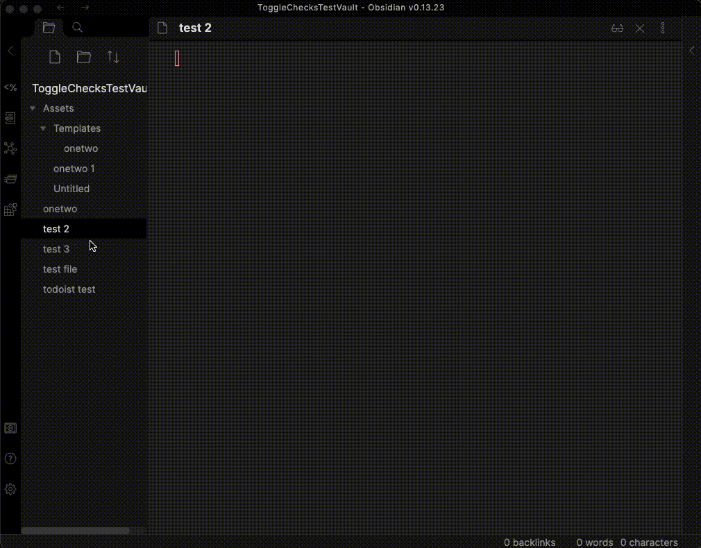

# Todoist Text - Obsidian Plugin

This obsidian plugin integrates your Todoist tasks with markdown checkboxes.

Demo: 

## Usage
1. Ensure you understand the security implications (see Security section of this file)
2. Install the plugin (Todoist Text) through Obsidian
3. Enable the plugin in Obsidian
4. Go to the Todoist Text settings and enter your Todoist API token, as explained in the settings
5. Configure a hotkey for checking off tasks (see below section)

### Marking tasks as complete and re-opening
You will likely want to use the `<Cmd>-<Enter>` hot key to check off tasks. To do this, go to the Settings -> Hotkeys. Find the command "Todoist Text: Toggle todoist task". Set the hot key as desired. If you set the hot key to `<Cmd>-<Enter>`, be sure to remove `<Cmd>-<Enter>` from its default ("Toggle Checklist Status").

You can use the "Todoist Text: Toggle todoist task" command/hot key for any check list item, even if it is unrelated to Todoist. Under the hood, the command will check the suffix of the check list item, and if it ends with a Todoist URL, it will update that todo on Todoist. If it does not end with a Todoist URL, it will simply check/uncheck the line locally.

### Automatic creation of task list
You will likely want to use this in your [daily notes](https://help.obsidian.md/Plugins/Daily+notes). For this to work, you can set your daily notes template to look something like:
```text
some text

(the following keyword can be configured in settings if you'd like)
@@TODOIST@@

some other text
```

When this plugin sees your keyword (`@@TODOIST@@`) on a newly opened file, it will replace that keyword with your Todoist tasks.

To prevent this replacement from happening in your template file, you should add your template folder location in "Excluded Folders" of this plugin's settings.

### Adding tasks
This plugin currently does not support adding tasks to Todoist. Until then, I recommend using the Todoist desktop app - it has a global shortcut that can quickly add a task from anywhere on your computer.

## Security 
This plugin stores your Todoist API token in plain text in your .obsidian/plugins folder. Anyone with your Todoist API token could access/manipulate all of your Todoist data. Ensure that you are not syncing/sharing your .obsidian/plugins folder for security purposes. Use this plugin at your own risk.

## Feature requests
Please reach out (by filing a GitHub issue) if you'd like to discuss possible new features or need help with anything! If you do see a github issue that already exists, feel free to comment on it, which could raise the priority/help inform how the feature is implemented

## Attribution
I copied the 'folder suggest' settings feature from https://github.com/liamcain/obsidian-periodic-notes - thanks!
